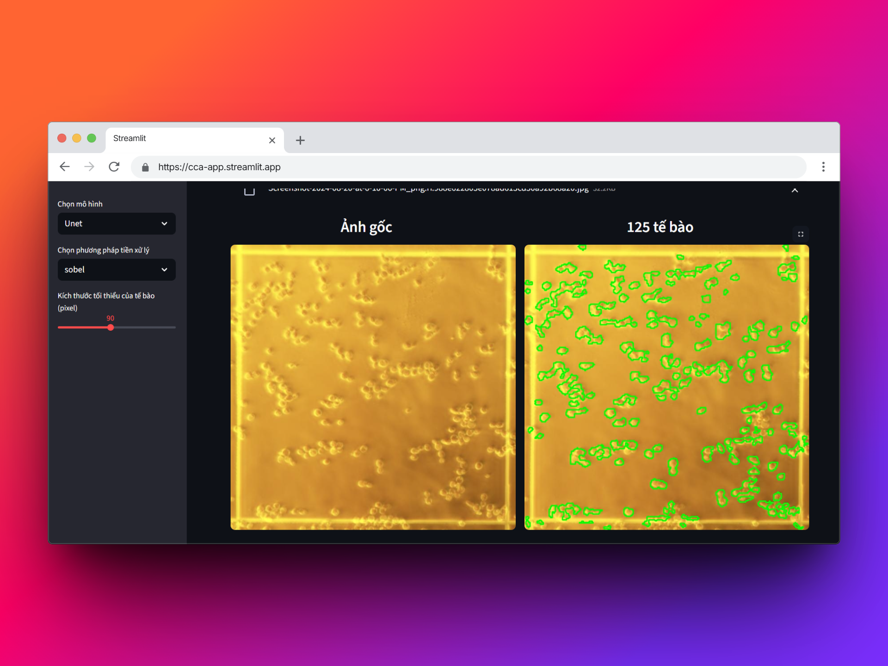

# Automatic-Lymphocyte-Cell-Counting-a-perspective-approach-from-image-segmentation-and-deep-learning

## Introduction  
Accurate lymphocyte cell counting plays a critical role in biomedical research and clinical diagnostics, providing essential insights into immune system health and disease progression. Traditionally, this task has been performed manually by experts under microscopes, which is both time-consuming and prone to human error. To address these challenges, automated computer vision techniques have emerged as promising solutions for reliable and scalable cell analysis.

In this project, we benchmark two popular deep learning approaches for lymphocyte cell counting:

- **YOLO (You Only Look Once)** — state-of-the-art object detection model for fast and precise localization.  
- **U-Net** — convolutional neural network designed for biomedical image segmentation, effective at capturing pixel-level structures.  

We evaluate both models on an augmented dataset of lymphocyte cell images, focusing on accuracy, error metrics, and robustness.  

---

## **Features**
- Automated lymphocyte cell counting for biomedical image analysis.
- Cell localization and detection using **YOLOv8**.
- Pixel-level segmentation using **U-Net**.
- Comparison of two approaches:
  - Detection-based (bounding box predictions with YOLO).
  - Segmentation-based (binary masks with U-Net).
- Evaluation with regression and error metrics:
  - **MSE**, **MAE**, **MAPE**, **R²**, **Dispersion Statistics**.
- Data augmentation pipeline (rotation, flipping, shifting, scaling, brightness adjustment, Gaussian noise).
- Benchmarking on augmented lymphocyte dataset with consistent training/testing splits.

---

## Project Structure  
```
│
├── .devcontainer/
│   └── devcontainer.json
│
├── experiment/                    
│   ├── data-augmentation-lymphocyte.ipynb
│   ├── lymphocyte-algorithms-final.ipynb
│   └── lymphocyte-deeplearning.ipynb
│
├── src/                            
│   ├── __init__.py
│   └── pipeline.py
│
├── images/             
│              
├── app.py                         
├── requirements.txt
├── runtime.txt
├── README.md
└── .gitignore
```
---

## **Pretrained Models**

* **U-Net**: [Download on Hugging Face](https://huggingface.co/Sura3607/cell_seg_unet)
* **YOLOv8**: [Download on Hugging Face](https://huggingface.co/Sura3607/cell_yolov8)

---

## **Cell Counting Application**

[Cell Counting App](https://cca-app.streamlit.app/)



The application allows you to:
- Upload microscopic cell images.
- Test both YOLOv8 (detection) and U-Net (segmentation) models.
- Visualize predictions with bounding boxes or segmentation masks.
- Get automated lymphocyte cell counts in real time.

---

## **Installation**

1. Clone repository:

   ```bash
   git clone https://github.com/Tommyhuy1705/Benchmarking-YOLO-and-U-Net-Segmentation-Models-for-Automated-Lymphocyte-Cell-Counting.git
   cd Automatic-Lymphocyte-Cell-Counting-a-perspective-approach-from-image-segmentation-and-deep-learning
   ```
2. Install dependencies:

   ```bash
   pip install -r requirements.txt
   ```

---

## **Usage**

* **Train U-Net**: run notebook in `experiment/lymphocyte-deeplearning.ipynb`.
* **Train YOLOv8**: run notebook in `experiment/lymphocyte-algorithms-final.ipynb`.
* **Data Augmentation**: see `experiment/data-augmentation-lymphocyte.ipynb`.
* **Use local app**:
   ```bash
  streamlit run app.py
  ```

---

## **Results**

| Model  | MSE | MAE | MAPE | R²  | Dispersion Statistics |
| ------ | --- | --- | ---- | --- | --------------------- |
| YOLOv8 | 39376.08 | 107.71 | 26.45  | 0.38 |166.65|
| U-Net  | 43043.62 | 121.71 | 34.53  | 0.32 |168.02|

---

## **Datasets**

* Roboflow Cell Counting Dataset (segmentation masks):
  [Kaggle link](https://www.kaggle.com/datasets/tensura3607/cell-counting-roboflow-segmentation-masks)

---

## **Contributions**

* Designed and implemented pipeline for automated lymphocyte cell counting.
* Integrated YOLOv8 and U-Net models.
* Applied extensive data augmentation.
* Evaluated models with multiple error metrics.

---

## **Future Work**

* Expand dataset size and diversity.
* Explore hybrid detection + segmentation models.
* Test lightweight architectures for real-time inference.
* Add more evaluation metrics (F1-score, precision/recall).
* Deploy models as a web API for easy integration.

---

## **Acknowledgments**

Special thanks to open-source contributors and dataset providers.


